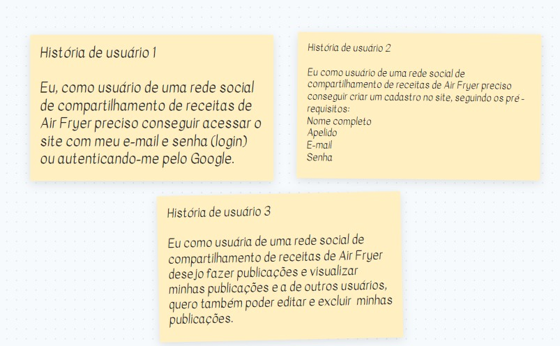
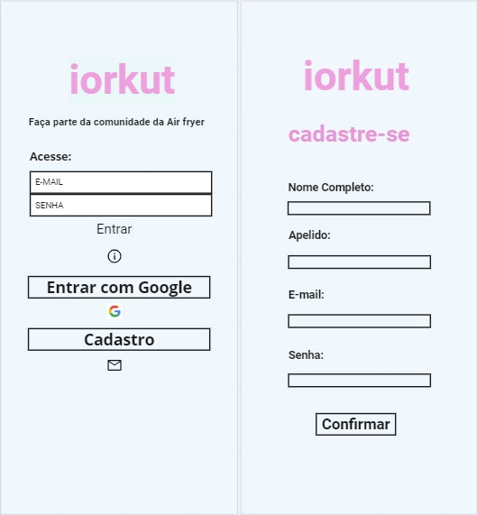
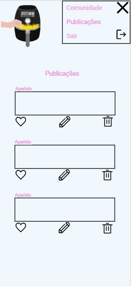
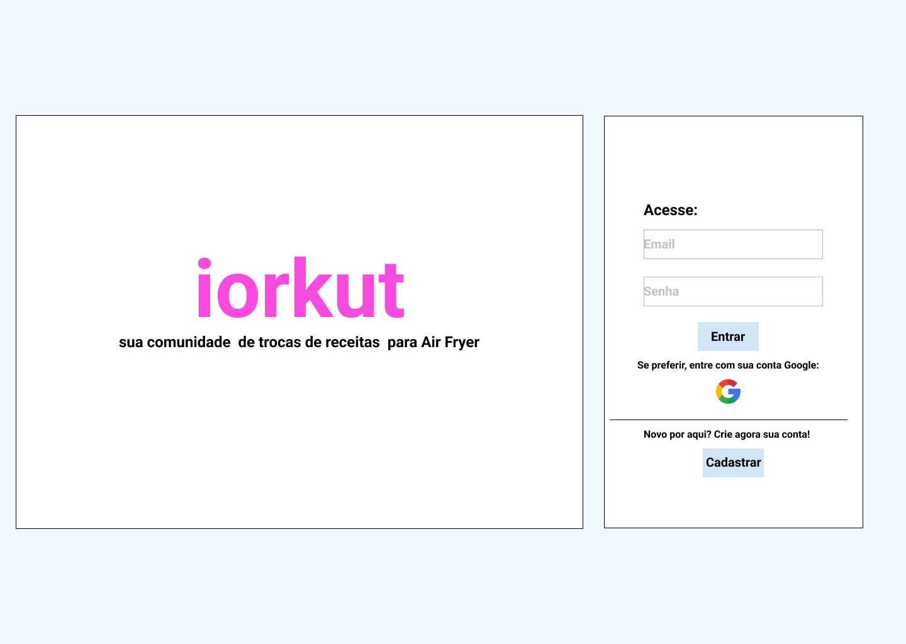
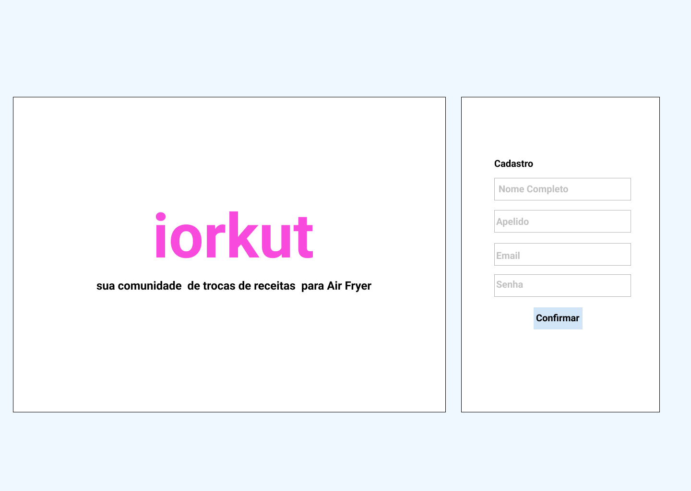
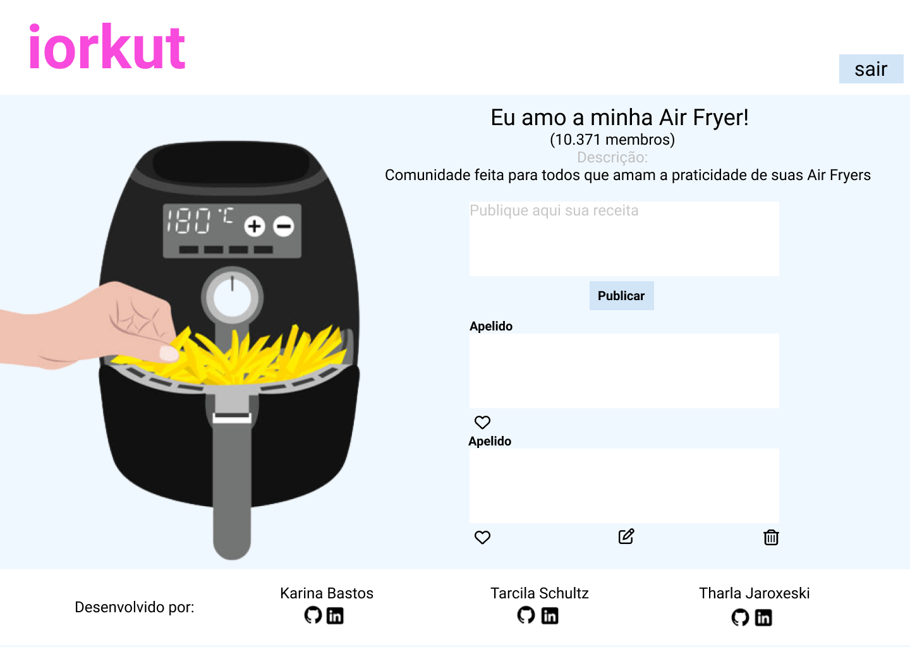
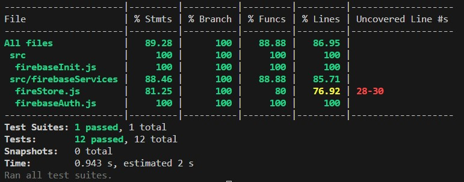

## Índice

* [1. Prefácio](#1-prefácio)
* [2. Resumo do projeto](#2-resumo-do-projeto)
* [3. Definição do Produto](#3-definição-do-produto)
* [4. História do Usuário](#4-historias-de-usuario)
* [5. Testes Unitários](#5-Testes-Unitários)
* [6. Checklist de objetivos alcançados ](#6-Checklist-de-objetivos-alcançados)

## 1. Prefácio

Instagram, Snapchat, Twitter, Facebook, Twitch, Linkedin, etc. As redes sociais
invadiram nossas vidas. Nós as amamos ou odiamos, e muitas pessoas não conseguem
viver sem elas.

Há redes sociais de todo tipo para todos os tipos de interesse. Por exemplo: em
uma rodada de financiamento com investidores, foi apresentada uma rede social
para químicos onde os usuários podem publicar artigos a respeito de suas
pesquisas, comentar os artigos de seus colegas e filtrar artigos de acordo com
determinadas tags ou popularidade, mais recente ou mais comentado.

## 2. Resumo do projeto

# iorkut - comunidade de receitas de airfryer

<b>Acesse o link do projeto aqui: "colocar link deploy"</b>

Terceiro projeto realizado durante o Bootcamp da Laboratória. O objetivo principal alcançado foi desenvolver uma rede social SPA responsiva, partindo do principio do conceito de Mobile first.  

Tema: iorkut - comunidade de receitas de airfyer, um alinhamento entre a nostalgia da antiga rede social Orkut, suas comunidades e uma rede para interações e trocas de receitas para o utensílio Airfyer.  

Funcionalidades:

- Criar conta com login e senha ou Google, autenticados pelo Firebase;
- Criar postagens de texto, curtir, editar e excluir;
- Navegar entre as páginas.

###  3.0 Definição do produto

Foi realizada uma pesquisa com 40 possíveis usuários para identificarmos pontos em comum do nosso público-alvo. 
Notamos que o utensílio mais utilizado, por 52% das pessoas pesquisadas foi a fritadeira elétrica( Air Fryer), dentre eles 94% se interessam por dicas de receitas e os lugares de busca por essas receitas, empatados em 75% foram sites especializados e redes sociais, sendo assim seguimos com a ideia de projeto criar uma aplicação onde o usuário tivesse a própria rede social para encontrar receitas específicas de air fryer, aliando com um estilo nostálgico que lembrasse uma antiga rede social de comunidades, como foi o Orkut. 

### 4.0 Histórias de usuário

### 4.1 Protótipos

### 5.0 Testes unitários

### 6.0 Checklist de objetivos alcançados 
⭕ Usar VanillaJS.

⭕ UI: É responsivo.

⭕ Passa pelo linter.

⭕ Passa pelos testes (npm test).

⭕ Ser uma Single Pages Application (SPA).

⭕ Inclui histórias de usuário no README.md.

⭕ Autenticação com Firebase e uso do Firestore.

⭕ Inclui uma definição de produto clara e informativa no README.md.

⭕ Inclui rascunho da solução (protótipo de alta fidelidade) no README.md.

⭕ Atender ao CRUD (Create, Reade, Update and Delete) utilizando o Firebase.

⭕ Testes unitários cobrem um mínimo de 70% de statements, functions, lines e branches

